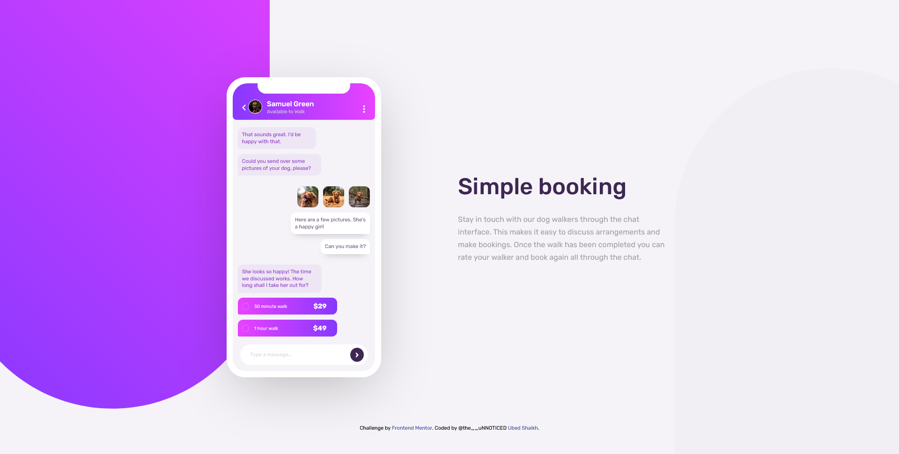

# Frontend Mentor - Chat app CSS illustration solution

This is a solution to the [Chat app CSS illustration challenge on Frontend Mentor](https://www.frontendmentor.io/challenges/chat-app-css-illustration-O5auMkFqY). Frontend Mentor challenges help you improve your coding skills by building realistic projects. 

## Table of contents

- [Overview](#overview)
  - [The challenge](#the-challenge)
  - [Screenshot](#screenshot)
  - [Links](#links)
- [My process](#my-process)
  - [Built with](#built-with)

### Screenshot

### Links

- Solution URL: [Click Here 🚀](https://github.com/ubed90/chat-app-css-illustration)
- Live Site URL: [Click Here 🚀](https://your-live-site-url.com)

## My process

### Built with

- Semantic HTML5 markup
- CSS custom properties
- Flexbox
- CSS Grid
- Mobile-first workflow
